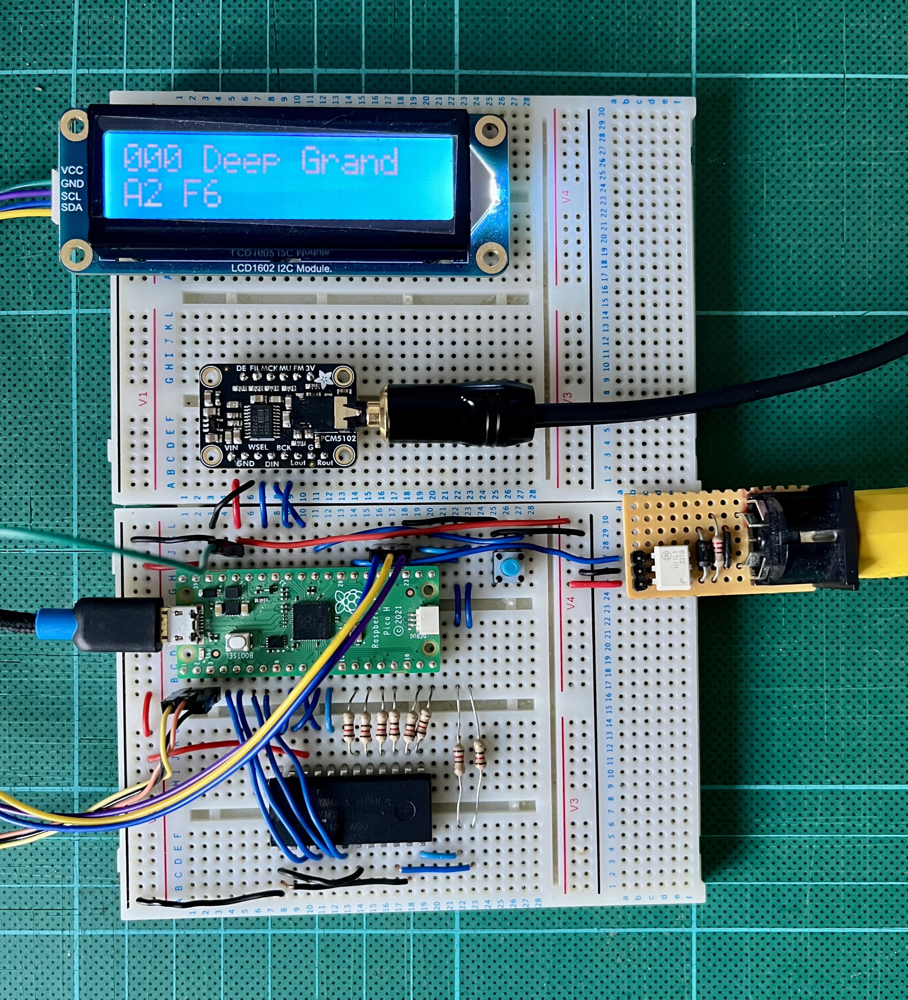

# Cambridge pico Chippy

A VGM player using a Raspberry Pi Pico, a YM2151 (OPM) sound chip and an I2S DAC.

Re-uses the same hardware as the sister project [picoX21H](https://github.com/AnotherJohnH/picoX21H)

[Block Diagram](docs/block_diagram.pdf)

## Status

WIP ... just started!!!

Working...
   + VGM decode (but only for supported chips)
   + YM2151 hardware driver and YMDAC to I2S translator
   + SegaPCM emulation mixed into the main I2S stream

## Hardware

[Schematic](docs/schematic.pdf) for the above.

## Software

### Checkout

This repo uses git sub-modules, so checkout using --recurse to clone all the
dependent source...

    git clone --recurse https://github.com/AnotherJohnH/picoChippy.git

ore

    git clone --recurse ssh://git@github.com/AnotherJohnH/picoChippy.git

### Software dependencies

+ https://github.com/AnotherJohnH/Platform
+ arm-none-eabi-gcc
+ cmake via UNIX make or auto detection of ninja if installed
+ Python3

### Build

Being developed on MacOS but should build on Linux too.

Indirect build of all supported targets, rpipico and rpipico2 with cmake and make (or ninja)...

    make

Build a single hardware target e.g. rpipico2 using cmake...

    mkdir build
    cd build
    cmake -DCMAKE_BUILD_TYPE=Release -DPLT_TARGET=rpipico2 -DCMAKE_TOOLCHAIN_FILE=Platform/MTL/rpipico2/toolchain.cmake ..
    make

flashable images will be found under the build sub-directory here...

    build/rpipico2/picoChippy_I2S_DAC.uf2

## License

This project is licensed under the MIT License - see the [LICENSE](LICENSE) file for details

## Acknowledgements

